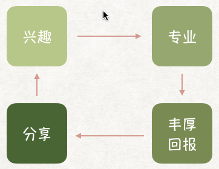

# Headline

> An awesome project.

这既是一个培训产品，我们也更希望能把它做成一个完成的项目 💪

写在最前面：[https://space.bilibili.com/1799937394](https://space.bilibili.com/1799937394)

# 关于项目
我们希望借助Github的影响力，通过笔记、视频和其它项目资源，分享一些学习、工作收获，以帮助更多的爱好互联网IT，爱好编程的朋友走近和踏入这个行业。

Bilibili入口：[https://space.bilibili.com/1799937394](https://space.bilibili.com/1799937394)

你的Follow和Star是对我们最大的鼓励。

> 我们的主张

不主张单纯为了找工作而学习 😳

# 关于内容
大部分的学习内容都非常基础，适合体验和入门。如希望在工作岗位和生产项目中使用，还需进行更深入和系统的学习。

> 课程制作思路：适合敏捷学习

以实用为核心，立足于生活和工作需要，不断迭代，循序渐进。

- 把复杂的知识体系讲解简单、易于理解和归纳，而在案例和项目中继续做垂直拓展和思考。
- 缩短学习周期，对知识做更细的切割
- 共同成长

# Welcome
所有的项目内容都是利用业余时间制作，如有勘误或不当之处，欢迎提交PR。
同时我们还有如下产品线暂未开发，期待你的加入：

- BigData 大数据
- Python + 人工智能

# 感恩
感恩平台、公司和家庭的支持！我们会持续产出，回馈行业和社会 🙏

# 联系我们
