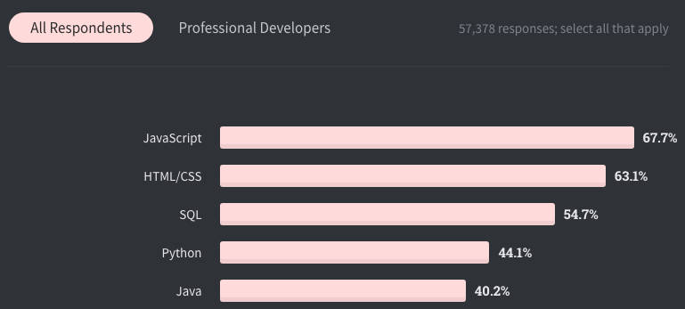

# Javascript
## 1. Part1 基础语法

[学习视频链接]: https://space.bilibili.com/1799937394

### 1.1 简介

> Javascript是什么？

全世界最常见、最受欢迎的开发语言，其增长的速度一致位居前列。

[Stackoverflow 2020调查报告]: https://insights.stackoverflow.com/survey/2020#technology

良好的市场环境，意味着较高的薪资水平：

[职友网2020 前端岗位薪酬]: https://www.jobui.com/salary/quanguo-qianduankaifagongchengshi/

> Javascript 能做什么？

在早期，主要用来开发基于浏览器的交互应用，但现在已能开发完整的基于PC端、移动端的完整应用，以及实时网络应用（聊天、视频流服务、游戏等）

> Javascript运行在什么地方？

- 浏览器的Javascript引擎，例如Chrome的v8，Firefox的SpiderMonkey
- Node（2009，Ryan基于开源的v8引擎开发的C++程序，可以用作后端服务）

> Javascript由哪些部分组成？

- ECMAScript，描述了该语言的语法和基本对象。
- 文档对象模型（DOM），描述处理网页内容的方法和接口。
- 浏览器对象模型（BOM），描述与浏览器进行交互的方法和接口。

### 1.2 环境搭建

[Visual Studio Code]: https://code.visualstudio.com/

其它的IDE：Sublime Text / Atom / Webstorm

安装Live server扩展（插件）：一个非常轻量级的网站服务器，可以让我们开发的时候，即时看到网站运行效果。

### 1.3 Helloworld

> 编写和组织Javascript有哪些形式？

- 行内格式
- 分离单独的文件

### 1.4 变量

### 1.5 常量

## 2. Part2 OOP

