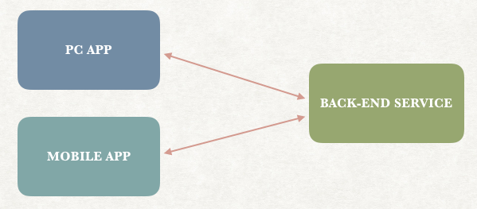
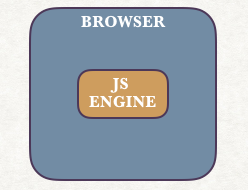
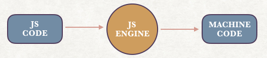
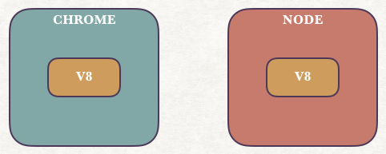

# NodeJS

## 1. Part1 - 基础入门

学习视频：[https://www.bilibili.com/video/BV18K4y1W7wW](https://www.bilibili.com/video/BV18K4y1W7wW)

在学习该知识之前你应该至少掌握`Javascript`

### 1.1 简介

> What is it?

简称Node，是一个开源的跨平台的Javascript运行环境，主要用来创建后端（back-end）服务，即API（Application Programming Interface）



> Why use it?

- 开发速度快，适应于敏捷开发（迭代速度快、循序渐进）
- 高扩展性
- 使用`Javascript`编写
- 强大的生态和众多的开源库

> How it works?

在Node出现之前：



- 微软Edge的Chakra
- 谷歌Chrome的v8
- 火狐Firefox的SpiderMonkey



2009年，`Ryan Dahl`基于运行速度最快的`Chrome V8`，使用`C++`创建了Node：



不再具备`window`、`document`，增加了`os`、`fs`、`http`等新特性。

!> Node不是一门编程语言（Programming Language），也不是框架（Framework），而是用来执行Javascript的运行环境（Runtime Environment）。

> Where？

Node最大的特性：无阻塞（Non-blocking）/ 异步（Asynchronous）


相较之Asp.net，Rails等框架，要实现异步，需要很多额外的编码工作，而Node默认即是以异步模式工作的。


- 适用于I/O-intensive型应用，例如大量读写磁盘、网络连接的应用场景
- 不适用于CPU-intensive型应用，例如视频渲染、图片操作的应用场景

### 1.2 安装

NodeJS中文官网：[https://nodejs.org/zh-cn/](https://nodejs.org/zh-cn/)

下载LTS（Long-Term Support）版本，别做小白鼠。

可以使用以下指令来检查Node版本：

```shell
node --version
```

可以使用以下版本进行更新：

```shell
npm i -g n
n stable
```

### 1.3 Helloworld

### 1.4 Module

### 1.5 NPM

## 2. Part2 - RESTful

## 3. Part3 - MongoDB

## 4. Part4 - Other Topics